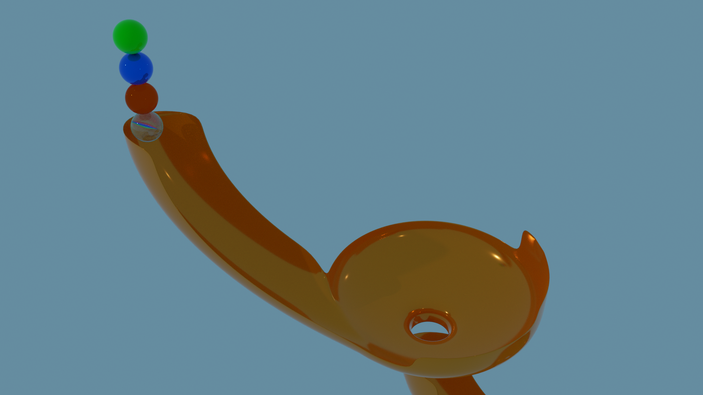

# Rigid Body Animation

ICG 2020 Final  
B04902048 蔡毓聰

## Intro

Being inspired by [Marble run videos](https://www.youtube.com/channel/UCYJdpnjuSWVOLgGT9fIzL0g), I want to recreate one of the race tracks with Blender and its physic engine.

## Why Blender

Blender is a free open source 3D modeling tool. Its has powerful features and script-like UI to build things with.It also comes with a command line mode, which enables me to render images in gui-less environments such as CSIE workstation.

I once considered using unity, but since all I need is some physic simulation, Unity would be an overkill for me.

## Process

Most part of shader and lighting is handled by Blender, all I need to so is modeling and tweaking the texture of the marbles.  
I basically followed [this youtube video](https://www.youtube.com/watch?v=fwSbmCW8qVg) to create the marble. Mixing different shader components to get the glassy texture.

## Results

Image Preview:

[Imgur Video link](https://imgur.com/zW7m8ob)
